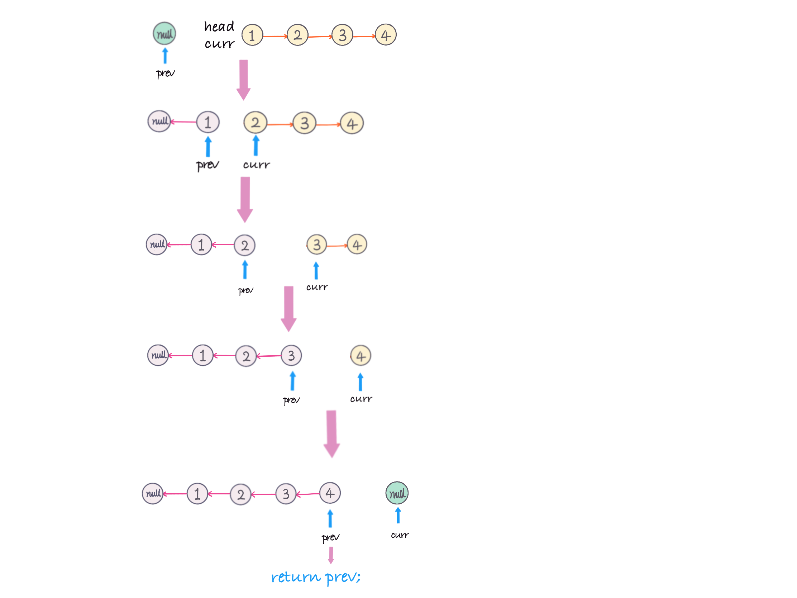

# Day01 数组、链表、跳表

## ArrayList

- 擅长查询
- 缺点是增删涉及数组拷贝

## Linked List  

- 擅长增删改
- 缺点是每次查询都要便利
- 回文检测
- 工程例子：LRU cashe(哈希表和双向链表)
> 如何基于链表实现 LRU 缓存淘汰算法？
    我们维护一个有序单链表，越靠近链表尾部的结点是越早之前访问的。当有一个新的数据被访问时，我们从链表头开始顺序遍历链表。
> 1. 如果此数据之前已经被缓存在链表中了，我们遍历得到这个数据对应的结点，并将其从原来的位置删除，然后再插入到链表的头部。
> 2.  如果此数据没有在缓存链表中，又可以分为两种情况：
>   - 如果此时缓存未满，则将此结点直接插入到链表的头部；
>   - 如果此时缓存已满，则链表尾结点删除，将新的数据结点插入链表的头部。
>     实际上，我们可以继续优化这个实现思路，比如引入散列表（Hash table）来记录每个数据的位置，将缓存访问的时间复杂度降到 O(1)。

1. 分类：
  - 单链表
  - 双链表(Java)
  - 循环链表

2. 简单实现
 ```java
class LinkedList{
    Node head;
    class Node {
        int data;
        Node next;
        Node(int d){ data = d; }
    }
}
 ```

## Skip List
为了不足链表的查询缺陷而设计
- 原理：多级索引
- 策略：空间换时间。空间复杂度O(n)，时间复杂度变为O(logn)
- 工程例子：redis

## LeetCode
- 技巧一：理解指针或引用的含义
- 技巧二：警惕指针丢失和内存泄漏
- 技巧三：利用哨兵简化实现难度
- 技巧四：重点留意边界条件处理
### 数组
11.盛最多水的容器： 双指针法，遍历元素;
```java
    public int maxArea(int[] height) {
        int max = 0;
        for(int i = 0, j = height.length - 1; i < j; ){
            int minHeight = height[i] < height[j] ? height[i++] : height[j--] ;
            int newArea =  ( j - i  + 1) * minHeight;
            max = Math.max(max, newArea);
        }
        return max;
    }
```
283.移动零： 双指针法，遍历元素; “滚雪球”？
```java
    public void moveZeroes(int[] nums) {
        int j = 0;
        for(int i=0; i<nums.length; i++){
            if(nums[i] != 0){
                //i=j no effect
                nums[j] = nums[i];
                if(i != j){
                    nums[i] = 0;
                }
                j++;
            }
        }
    }
```
70.爬楼梯:
  - 未见过的问题思路：1. 暴力 2. 找规律
  - 因为程序逻辑：1. if-else 2. for while 3. recursion
  - 分析： 
    - 1级台阶：1种；
    - 2级台阶：2种；
    - 3级台阶: f(1) + f(2); //2级开始，1种；1级开始，2种
    - 4级台阶: f(2) + f(3)  //3级开始，1种；2级开始，2种
  -  f(n) = f(n-1)+f(n-2) 斐波拉数列；定义初始条件，循环。
  ```java
      public int climbStairs(int n) {
        if(n < 3)
            return n;
        int f1 = 1, f2 = 2, f3 = 3;
        for(int i = 3; i <= n; i++){
            f3 = f2 + f1;
            f1 = f2;
            f2 = f3;
        }
        return f3;
    }
  ```
 1.两数之和
 ```java
 //暴力
     public int[] twoSum(int[] nums, int target) {
        for(int i=0; i<nums.length; ++i){
            for(int j = i+1; j<nums.length; ++j){
                if(nums[i]+nums[j] == target){
                    int[] reslut= {i , j};
                    return reslut;
                }
            }
        }
        return null;
    }
 ``` 
 15.三数之和
 - 关键字：不可以包含重复
 - 模式识别：利用排序避免重复答案
 - 
 ```java
     public List<List<Integer>> threeSum(int[] nums) {
        List<List<Integer>> ans = new ArrayList<>();
        if (nums == null || nums.length <= 2) return ans;
        Arrays.sort(nums); // O(nlogn)
        for (int i = 0; i < nums.length - 2; i++) { // O(n^2)
            if (nums[i] > 0) break; // 第一个数大于 0，后面的数都比它大，肯定不成立了
            if (i > 0 && nums[i] == nums[i - 1]) continue; // 去掉重复情况
            int target = -nums[i];
            int left = i + 1, right = nums.length - 1;
            while (left < right) {
                if (nums[left] + nums[right] == target) {
                    ans.add(new ArrayList<>(Arrays.asList(nums[i], nums[left], nums[right])));
                    
                    // 现在要增加 left，减小 right，但是不能重复，比如: [-2, -1, -1, -1, 3, 3, 3], i = 0, left = 1, right = 6, [-2, -1, 3] 的答案加入后，需要排除重复的 -1 和 3
                    left++; right--; // 首先无论如何先要进行加减操作
                    while (left < right && nums[left] == nums[left - 1]) left++;
                    while (left < right && nums[right] == nums[right + 1]) right--;
                } else if (nums[left] + nums[right] < target) {
                    left++;
                } else {  // nums[left] + nums[right] > target
                    right--;
                }
            }
        }
        return ans;
    }
 ```

 ### 链表
 24.两两交换链表中的节点
 ```java
    public ListNode swapPairs(ListNode head) {
        ListNode dummyHead = new ListNode(-1);
        dummyHead.next = head;
        ListNode prevNode = dummyHead;
        while((head != null) && (head.next != null)){
            ListNode firstNode = head, secondNode = head.next;
            prevNode.next = secondNode;
            firstNode.next = secondNode.next;
            secondNode.next = firstNode;
            head = firstNode.next;
            prevNode = firstNode;
        }
        return dummyHead.next;
    }
 ```
 25.k个一组翻转链表
 
 
 ```java
     public ListNode reverseKGroup(ListNode head, int k) {
        if (head == null || k == 1) {
          return head;
        }
        ListNode dummy = new ListNode(0);
        dummy.next = head; //标记链表头
  
        ListNode start = dummy;//定义反转起始点
        ListNode end = head;//定义反转结束点
        int count = 0;
        while (end != null) {//链表遍历结束条件
          count++;
          // group
          if (count % k == 0) {
            // reverse linked list (start, end]
            start = reverse(start, end.next);//返回反转的结束位置
            end = start.next;//设置新的遍历起点
          } else {
            end = end.next;//长度不够k，加一
          }
        }
        return dummy.next;
      }
 ```

 141.环形链表I
 注意 ```if```中的判断条件顺序，必须firstnode放在第一位。其次，初始化 fast = slow = head ，因此若这么写，循环 while(slow!=fast) 会直接跳出
 ```java
    public boolean hasCycle(ListNode head) {
        if (head == null || head.next == null) {
            return false;
        }
        ListNode firstNode = head.next, secondNode = head;
        while(firstNode != secondNode){
            if( firstNode == null || firstNode.next == null){
                return false;
            }
            secondNode = secondNode.next;
            firstNode = firstNode.next.next;
        }
        return true;
    }
 ```
 142.环形链表II
 代数求解，在快慢指针的相遇点重新开始，与表头出发的指针相遇处即为环入口
 ```java
     public ListNode detectCycle(ListNode head) {
        ListNode firstNode = head, secondNode = head;
        while (true) {
            if (firstNode == null || firstNode.next == null) return null;
            firstNode = firstNode.next.next;
            secondNode = secondNode.next;
            if (firstNode == secondNode) break;
        }
        firstNode = head;
        while (secondNode != firstNode) {
            secondNode = secondNode.next;
            firstNode = firstNode.next;
        }
        return firstNode;
    }
 ```
 206.反转链表
 ```java
     public static ListNode reverseList1(ListNode head) {
        if ( head == null || head.next == null){
            return head;
        }
        ListNode newHead = reverseList1(head.next);
        head.next.next = head; //将head设置为下一个元素的下一个
        head.next = null;
        return newHead;
    }
    public static ListNode reverseList2(ListNode head) {
        if ( head == null || head.next == null){
            return head;
        }
        ListNode newhead = null;
        while(head != null){
            ListNode nextNode = head.next;
            head.next = newhead;
            newhead = head;
            head = nextNode;
        }
        return newhead;
    }
 ```

 ### 课后
 21.合并两个有序链表
 ```java
     public ListNode mergeTwoLists(ListNode l1, ListNode l2) {
        ListNode ans = new ListNode(-1);
        ListNode curr = ans;
        while( l1 != null && l2 != null){
            if(l1.val < l2.val){
                curr.next = l1;
                l1 = l1.next;
            }else{
                curr.next = l2;
                l2 = l2.next;
            }
            curr = curr.next;
        }
        curr.next = l1==null?l2:l1;
        return ans.next;
    }
 ```
 26.删除排序数组中的重复项
 ```java
     public int removeDuplicates(int[] nums) {
        if (nums.length == 0) return 0;
        int size = nums.length;
        int i = 0;
        for(int j = 1; j<size; ++j){
            if (nums[j] != nums[i]) {
                i++;
                nums[i] = nums[j];
            }
        }
        return i+1;
    }
 ```
 66.加一
 ```java
     public int[] plusOne(int[] digits) {
        if(digits == null){
            return null;
        }
        for (int i = digits.length - 1; i >= 0; i--) {
            digits[i]++;
            digits[i] = digits[i] % 10;
            if (digits[i] != 0) return digits;
        }
        digits = new int[digits.length + 1];
        digits[0] = 1;
        return digits;
    }
 ```
 189.旋转数组
 ```java
        public void rotate(int[] nums, int k) {
            k %= nums.length;
            reverse(nums, 0, nums.length - 1);
            reverse(nums, 0, k - 1);
            reverse(nums, k, nums.length - 1);
        }
        public void reverse(int[] nums, int start, int end) {
            while (start < end) {
                int temp = nums[start];
                nums[start] = nums[end];
                nums[end] = temp;
                start++;
                end--;
            }
        }
 ```
 